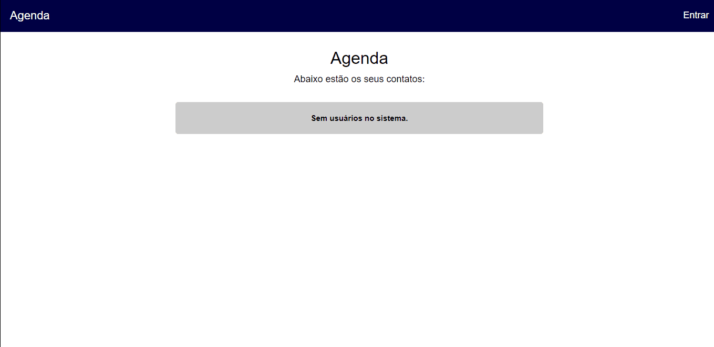
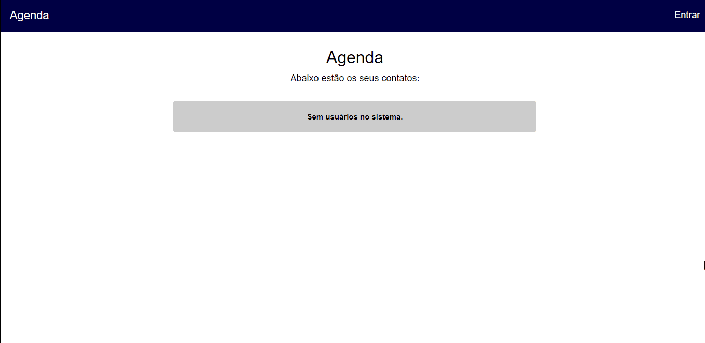
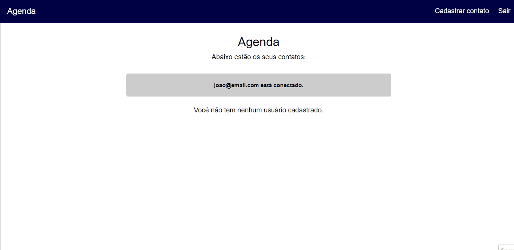
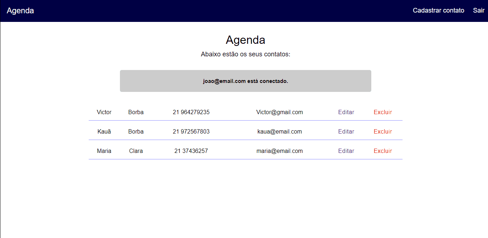
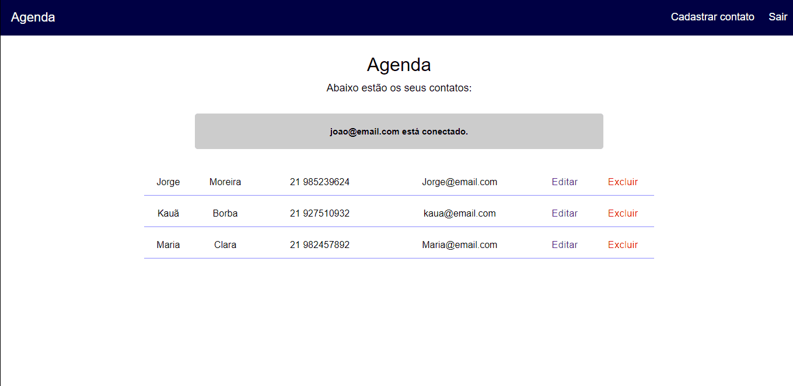

<h1 align="center">Agenda</h1>

<p align="center">Este é um projeto de uma agenda de contatos que fiz com algumas tecnologias de back-end.</p>
<br>

### ✨ Features

- [x] Cadastrar e logar um usuário
- [x] Cadastrar contatos e listar na tela
- [x] Deslogar usuários
- [x] Deletar contatos
- [x] Editar contatos

<br>

<h1 align="center">
    
</h1>

<h1 align="center">
    
</h1>

<h1 align="center">
    
</h1>

<h1 align="center">
    
</h1>


<h1 align="center">
    
</h1>

### Pré-requisitos

Os pré-requisitos para rodar essa aplicação na sua máquina é ter as seguintes ferramentas:<br>
[Git](https://git-scm.com), [Node.js](https://nodejs.org/en/).<br>
Além disso é bom que tenha um editor para trablhar com o código como [VScode](https://code.visualstudio.com/)

<br>

### 🎲 Rodando a aplicação

```bash
    # Clone este repositório
    $ git clone https://github.com/Kakaziu/Agenda

    # Acesse a pasta do projeto
    $ cd agenda

    # Instale as dependências
    $ npm i

    # Execute a aplicação
    $ npm start 

    # O servidor executará na porta 5000 - acesse http://localhost:5000
```
<br>

### 🛠️ Tecnologias

As seguintes ferramentas forma ultilizadas no projeto:

- [Javascript](https://www.javascript.com)
- [Node.js](https://nodejs.org/en/)
- [Express](http://expressjs.com/pt-br/)

<hr>

Feito por Kakaziu (Kauã Ferreira Borba) 🖤 [Linkedin](https://www.linkedin.com/in/kau%C3%A3-borba-390946235/)


